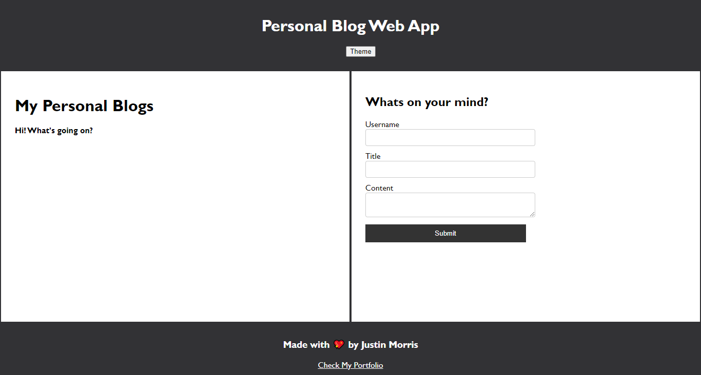
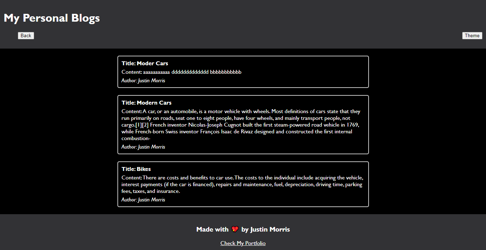

# Module-4-Challenge-Web-APIs-PersonalBlog
Web APIs Challenge: Personal Blog Portal with light and dark mode enabled.

# Site Link
https://jmorris38.github.io/Module-4-Challenge-Web-APIs-PersonalBlog/

## Description 
Required user story: 

AS A marketing student
I WANT a personal blog
SO THAT I can showcase my thoughts and experiences

## Website Preview

Submit Blog Preview:

All Blog Posts Available:

